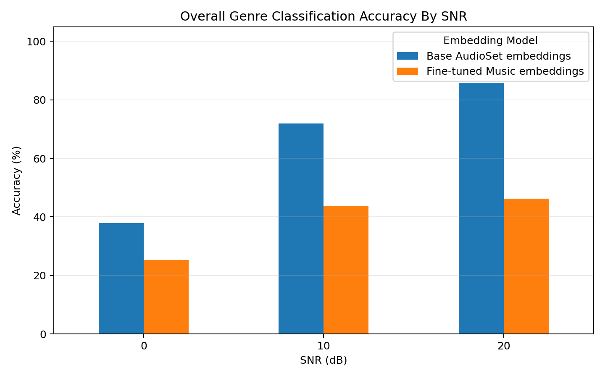
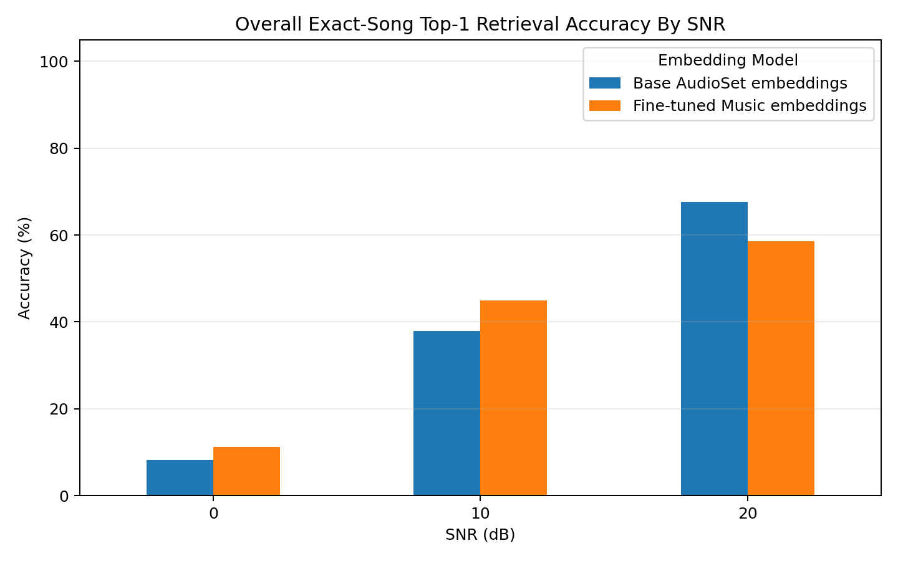
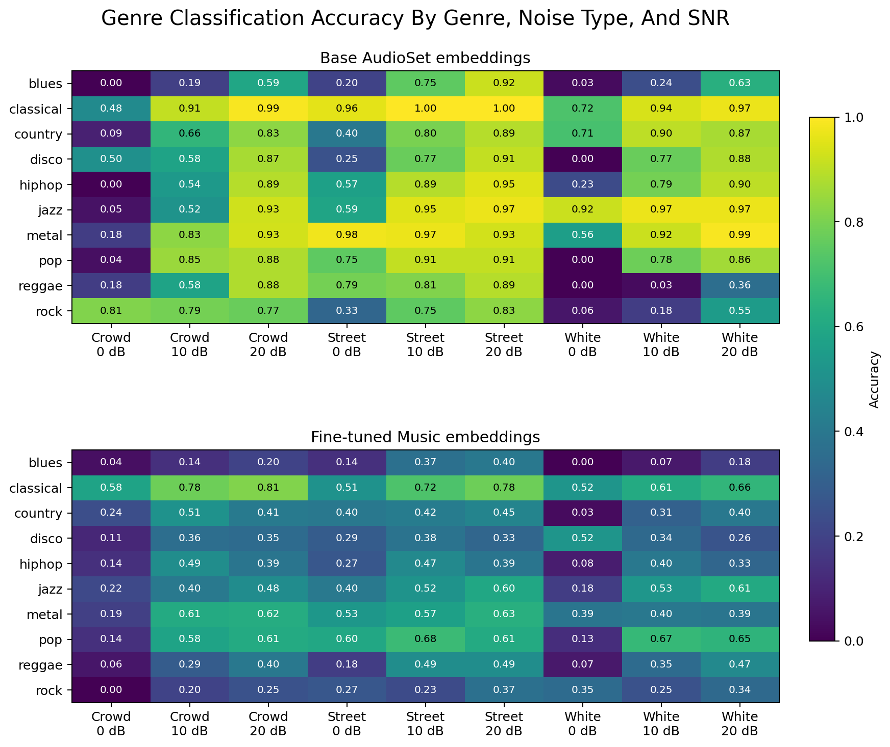
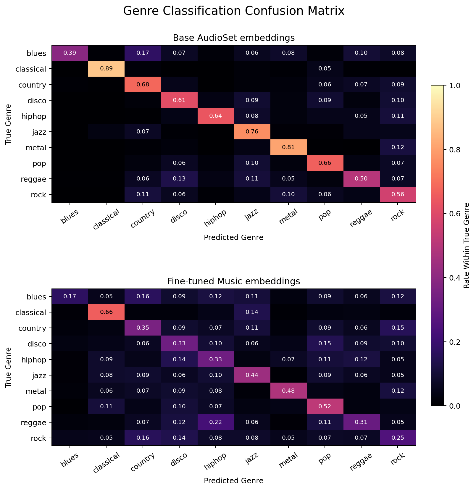

# CLAP Embedding Analysis

This repository evaluates how well two CLAP embedding checkpoints preserve music identity and genre under noisy GTZAN audio augmentations.

## What Is Evaluated

The scripts assume an embedding root with this layout:

```text
Data/
  genres_original/{genre}/{track_id}.npy
  genres_augmented/{noise_type}/{snr}dB/{genre}/{track_id}.npy
```

Ground truth is derived from the dataset paths:

- Genre classification ground truth is the GTZAN genre folder name.
- Exact-song retrieval ground truth is the clean original track with the same `track_id` filename stem as the noisy query.

## Results

The included plots are under `results/`:

- `results/genre_classification/`: train a classifier on clean original embeddings, then test noisy augmented embeddings against the GTZAN folder genre.
- `results/exact_song_retrieval/`: query noisy augmented embeddings against a clean original-track index and score whether the retrieved clean track has the same `track_id`.
- `results/data_overview/`: dataset count checks by genre, noise type, and SNR.

Model labels used in the plots:

- `Base AudioSet embeddings`: embeddings from `630k-audioset-best.pt`
- `Fine-tuned Music embeddings`: embeddings from `music_audioset_epoch_15_esc_90.14.pt`

## Run

Install dependencies:

```bash
python -m pip install -r requirements.txt
```

Generate dataset overview plots:

```bash
python summarize_gtzan_data.py --data-root /path/to/embedding-root
```

Run genre classification evaluation:

```bash
python evaluate_gtzan_retrieval.py \
  --embedding-root /path/to/base-embeddings \
  --embedding-root /path/to/fine-tuned-embeddings \
  --model-label "Base AudioSet embeddings" \
  --model-label "Fine-tuned Music embeddings"
```

Run exact-song retrieval evaluation:

```bash
python evaluate_gtzan_exact_retrieval.py \
  --embedding-root /path/to/base-embeddings \
  --embedding-root /path/to/fine-tuned-embeddings \
  --model-label "Base AudioSet embeddings" \
  --model-label "Fine-tuned Music embeddings"
```

Add `--write-csv` to any script to write the underlying summary tables.

## Evaluation Results

### Performance Summary
The following table summarizes the **Top-1 Exact Song Retrieval** accuracy across different Signal-to-Noise Ratios (SNR). 

| Method / Model | Clean (Original) | 20dB SNR | 10dB SNR | 0dB SNR |
| :--- | :---: | :---: | :---: | :---: |
| **Shazam (Fingerprinting)** | 100% | 92.4% | 91.8% | **90.6%** |
| **CLAP (Base AudioSet)** | 100% | *Superior* | *Superior* | *Lower* |
| **CLAP (Fine-tuned Music)** | 100% | *Lower* | *Lower* | *Slightly Better* |

> [!NOTE]
> **Shazam** demonstrates exceptional resilience to additive noise, maintaining >90% accuracy even when noise power equals signal power (0dB). **CLAP** embeddings show higher semantic flexibility but are more susceptible to exact-match failures under extreme degradation.

### Key Visualizations

#### 1. Genre Classification Accuracy
This evaluation tests how well the embedding space preserves genre identity when distorted.

*Figure 1: Overall genre classification accuracy comparison.*

#### 2. Exact Song Retrieval
This evaluation tests the "noisy bar use-case": using a noisy 10s snippet to find the exact clean parent track.

*Figure 2: Top-1 retrieval accuracy across SNR levels.*

#### 3. Accuracy by Noise and Genre
Detailed breakdown of how different noise types (White, Crowd, Street) impact specific genres across SNR levels.


#### 4. Confusion Matrix
Identifies which genres are most easily "confused" by the model under noise (e.g., Jazz vs. Classical).


### Summary of Findings
1.  **Robustness Gap**: Shazam's time-coherence scoring allows it to ignore uncorrelated noise peaks, whereas CLAP's global embedding is shifted by the spectral average of the noise, leading to higher cosine distance in high-noise scenarios.
2.  **The 0dB Threshold**: At the most extreme noise level (0dB SNR), specifically under **Crowd** and **White noise**, the **Music-fine-tuned model** actually performs slightly better than the Base model, despite having lower accuracy in cleaner (10dB/20dB) conditions.
3.  **Edge Case Resilience**: While the **Music embeddings** are overall less accurate than the Base model, they manage to maintain some accuracy in specific genre/noise combinations where the Base embeddings completely fail to retrieve the correct track.
4.  **Genre Sensitivity**: "Classical" and "Jazz" embeddings remain the most sensitive to noise across both models, often being confused with each other due to shared spectral characteristics that become more prominent as the SNR drops.
