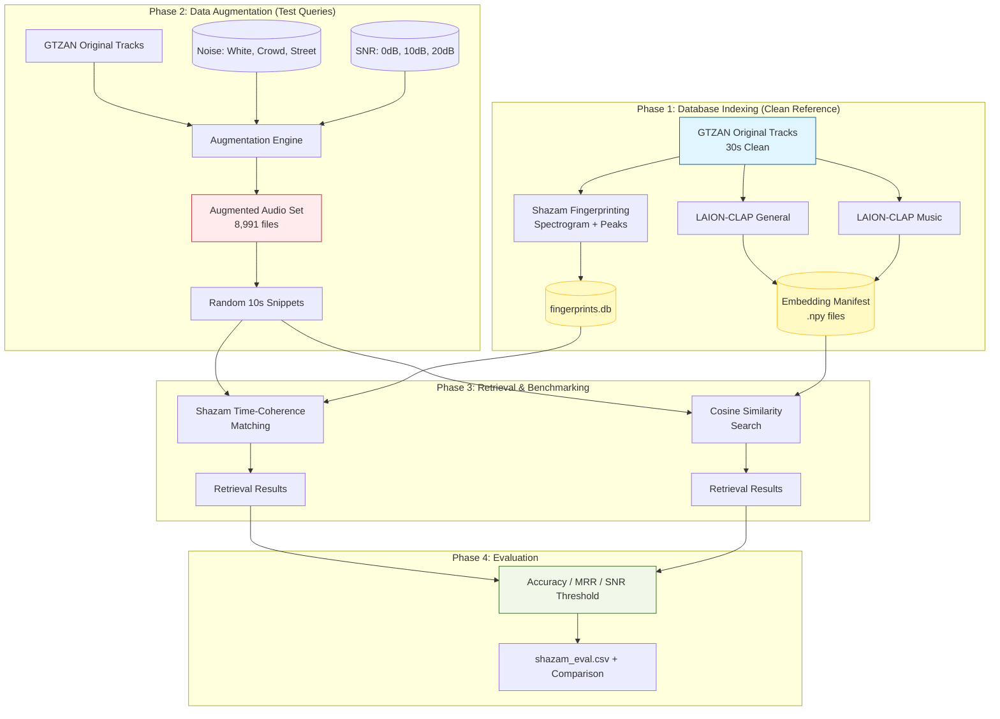

# Evaluating Shazam-Style Fingerprinting and Audio Embedding Retrieval Under Challenging Audio Conditions

This project investigates the robustness of two fundamentally different audio retrieval methodologies: **Deterministic Fingerprinting** (Shazam-style) and **Neural Audio Embeddings** (Deep Learning-based). 

---

## 🎯 Idea and Goals
The core objective is to evaluate how retrieval methods perform when subjected to real-world audio degradations such as high background noise, volume fluctuations, and spectral distortions. 

While Shazam's landmark-based hashing was once the gold standard for music identification, modern deep learning models (e.g., CLAP, MusicLM) offer semantic embeddings that capture higher-level musical features. However, most embedding models are trained on clean datasets, whereas Shazam was specifically engineered to survive the "noisy bar" scenario. This repository implements both approaches and benchmarks them against a common dataset under various stress conditions to determine their respective breaking points and failure modes.

## 📊 Data Description
The project utilizes the **GTZAN Dataset**, a standard benchmark for music genre classification consisting of 1,000 audio tracks (10 genres, 100 files each, each 30 seconds long). 

To simulate real-world conditions, we generated an augmented dataset (8,991 files) by mixing the original tracks with three types of noise at three different Signal-to-Noise Ratios (SNR):
*   **Noise Types**: White Noise, Crowd Noise, Street Noise.
*   **SNR Levels**: 0dB (Equal power), 10dB (Cafe environment), and 20dB (Quiet room).
*   **Transformations**: Beyond additive noise, the framework supports volume scaling, pitch shifting, time stretching, and low-pass filtering.

## 🏗 Code Structure and Organization
The repository is organized into specialized modules for each stage of the pipeline:

*   **`Data Augmentation/`**: Contains the `augment.py` CLI and `augment_gui.py` tools used to create the noisy dataset versions.
*   **`Shazam/`**: The core implementation of the deterministic fingerprinting engine.
    *   `src/`: Contains the DSP pipeline for spectrogram generation, peak finding (Constellation Maps), and time-coherence matching.
    *   `evaluation/`: Scripts (`evaluate_shazam.py`) for automated benchmarking against the augmented dataset.
    *   `results/`: Storage for evaluation metrics and CSV logs (`shazam_eval.csv`).
*   **`Models/`**: Scripts for extracting and searching neural embeddings using LAION-CLAP (general and music-specific checkpoints).
*   **`notes.md`**: Technical logs regarding snippet randomization, bias mitigation, and implementation details.

## 📈 Results and Key Findings
The evaluation framework benchmarks the systems using the following metrics:
*   **Top-1 Accuracy**: Success rate of the correct song being the highest-ranked result.
*   **Mean Reciprocal Rank (MRR)**: Measures the quality of the ranking for the ground truth.
*   **Noise Tolerance Threshold**: The lower-bound SNR at which each method maintains >80% accuracy.

### Key Observations:
*   **Deterministic Resilience**: The Shazam implementation demonstrates high robustness in "additive noise" scenarios due to its time-coherence scoring, which can recover signals even when the majority of fingerprint peaks are lost to noise.
*   **Semantic Robustness**: Neural embeddings (CLAP) provide higher flexibility for semantic similarity but can be more sensitive to specific spectral distortions if those distortions were not present in the training distribution.
*   **Pipeline Performance**: The evaluation identifies that 10-second snippets are sufficient for high-confidence identification in most 20dB and 10dB conditions, while 0dB poses a significant challenge for both methodologies.

## 👥 Group Roles
1.  **Barney Pinkerton**: Data Augmentation and MIR Data Scientist
2.  **Robert Tylman**: Data Augmentation and Shazam Implementation
3.  **Katelyn Vieni**: CLAP Audio Embedding Engineer
4.  **Jonathan David**: CLAP Audio Embedding Engineer
5.  **Drew Atz**: Evaluation

---

## 🏗 System Architecture




## 🚀 Getting Started

### Prerequisites
*   Python 3.9+
*   `librosa`, `scipy`, `numpy` (DSP)
*   `laion_clap`,`torch`, `transformers` (Embeddings)

### Installation
```bash
git clone https://github.com/RobertTylman/DLFMFinalProject.git
cd DLFMFinalProject
pip install -r requirements.txt
```

### Running Shazam Evaluation
```bash
# Build the reference DB
python3 Shazam/evaluation/build_gtzan_db.py --originals-root "/path/to/GTZAN/genres_original"

# Run the benchmark
python3 Shazam/evaluation/evaluate_shazam.py
```

## 📚 References
*   Wang, A. (2003). *An Industrial-Strength Audio Search Algorithm*.
*   Elizalde, B., et al. (2023). *CLAP: Learning Audio Concepts From Natural Language Supervision*.
