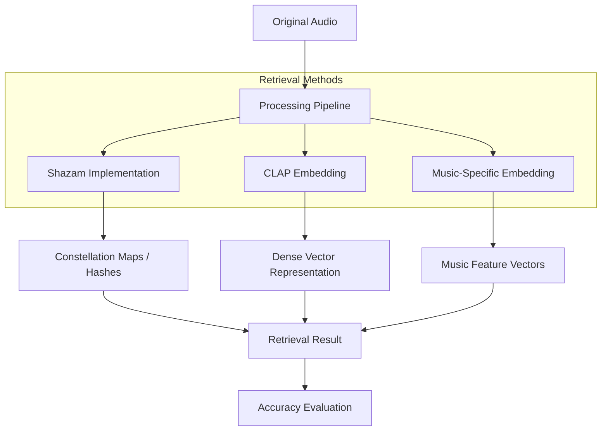

# Evaluating Shazam-Style Fingerprinting and Audio Embedding Retrieval Under Challenging Audio Conditions

This project investigates the robustness of two fundamentally different audio retrieval methodologies: **Deterministic Fingerprinting** (Shazam-style) and **Neural Audio Embeddings** (Deep Learning-based). 

The core objective is to evaluate how these methods perform when subjected to real-world audio degradations such as high background noise, volume fluctuations, and spectral distortions.

---

## 📑 Project Overview

While Shazam's landmark-based hashing was once the gold standard for music identification, modern deep learning models (e.g., CLAP, MusicLM) offer semantic embeddings that capture higher-level musical features. However, most embedding models are trained on clean datasets, whereas Shazam was specifically engineered to survive the "noisy bar" scenario.

This repository implements both approaches and benchmarks them against a common dataset under various stress conditions.

### Retrieval Methodologies
1.  **Shazam-Style Fingerprinting**:
    *   Generation of **Constellation Maps** from spectrogram peaks.
    *   Combinatorial hashing of peak pairs (Landmarks).
    *   Time-offset histogram matching for retrieval.
2.  **Generic Audio Embeddings (CLAP)**:
    *   Contrastive Language-Audio Pretraining (CLAP) for broad acoustic feature extraction.
    *   Vector similarity search (Cosine Similarity).
3.  **Music-Specific Embeddings**:
    *   Implementation of models specialized for musical content (potentially noise-resilient architectures).
    *   Comparison against generic models to see if domain-specialization improves robustness.

---

## 🏗 System Architecture



---

## 🧪 Experimental Framework

To measure performance, we apply a series of **Audio Transformations** to the query clips:

| Transformation | Purpose | Parameters |
| :--- | :--- | :--- |
| **Additive Noise** | Simulate real-world environments | White noise, Crowd noise (-10dB to +10dB SNR) |
| **Volume Scaling** | Test gain invariance | -20dB to -3dB gain |
| **Pitch Shifting** | Test frequency resilience | ±2 semitones |
| **Time Stretching** | Test temporal resilience | 0.9x to 1.1x speed |
| **Low-Pass Filtering** | Simulate poor speaker/mic quality | 4kHz, 8kHz cutoffs |

---

## 📈 Evaluation Metrics

*   **Top-1 Accuracy**: Probability that the correct song is the highest-ranked result.
*   **Mean Reciprocal Rank (MRR)**: Evaluates the rank of the correct song in the result list.
*   **Noise Tolerance Threshold**: The lower-bound SNR at which each method maintains >80% accuracy.

---

## 🚀 Getting Started

### Prerequisites
*   Python 3.9+
*   `librosa`, `scipy`, `numpy` (DSP)
*   `laion_clap`,`torch`, `transformers` (Embeddings)
*   `weaviate` or `faiss` (Vector Search)

### Installation
```bash
git clone https://github.com/RobertTylman/DLFMFinalProject.git
cd DLFMFinalProject
pip install -r requirements.txt
```

### Usage
*(Usage instructions will be updated as the implementation progresses)*

Download the CLAP checkpoints and update the hardcoded `ckpt_path`, `input_root`, and `output_root` values in each script before running.

Checkpoint downloads:
- General checkpoint: [`630k-audioset-best.pt`](https://huggingface.co/lukewys/laion_clap/resolve/main/630k-audioset-best.pt)
- Music checkpoint: [`music_audioset_epoch_15_esc_90.14.pt`](https://huggingface.co/lukewys/laion_clap/resolve/main/music_audioset_epoch_15_esc_90.14.pt)

In `Models/CLAP_general.py`, set:
```python
input_root = Path("/path/to/dataset")
output_root = Path("/path/to/output_embeddings")
ckpt_path = Path("/path/to/630k-audioset-best.pt")
---

## 🛠 Roadmap
- [ ] Implement Shazam Constellation Mapping.
- [ ] Integrate CLAP model for generic embeddings.
- [ ] Benchmark baseline accuracy on clean dataset.
- [ ] Implement audio transformation pipeline.
- [ ] Perform comparative analysis under noise.

---

## 📚 References
*   Wang, A. (2003). *An Industrial-Strength Audio Search Algorithm*.
*   Elizalde, B., et al. (2023). *CLAP: Learning Audio Concepts From Natural Language Supervision*.
