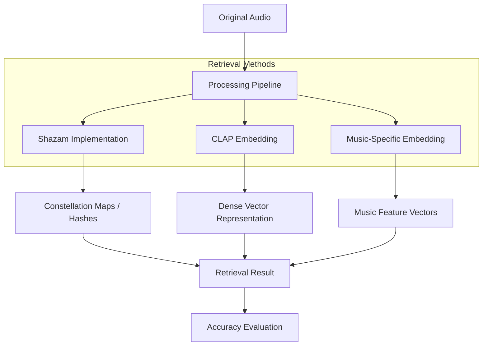
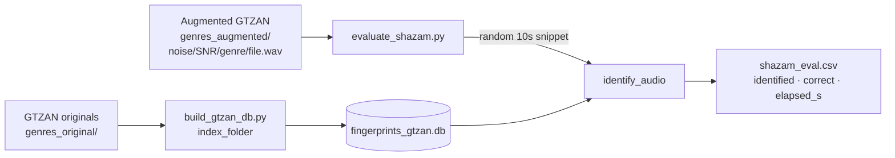

# Evaluating Shazam-Style Fingerprinting and Audio Embedding Retrieval Under Challenging Audio Conditions

This project investigates the robustness of two fundamentally different audio retrieval methodologies: **Deterministic Fingerprinting** (Shazam-style) and **Neural Audio Embeddings** (Deep Learning-based). 

The core objective is to evaluate how these methods perform when subjected to real-world audio degradations such as high background noise, volume fluctuations, and spectral distortions.

---

## 📑 Project Overview

While Shazam's landmark-based hashing was once the gold standard for music identification, modern deep learning models (e.g., CLAP, MusicLM) offer semantic embeddings that capture higher-level musical features. However, most embedding models are trained on clean datasets, whereas Shazam was specifically engineered to survive the "noisy bar" scenario.

This repository implements both approaches and benchmarks them against a common dataset under various stress conditions.

### Data 
1. GTZAN Dataset
   * 10 genres, 100 files each, 30 sec. long

2. Added augmentations at 0dB, 10dB, and 20dB (one augmented version per transformation per track)
   * White Noise
   * Crowd Noise
   * Street Noise 

### Retrieval Methodologies
1.  **Shazam-Style Fingerprinting**:
    *   Generation of **Constellation Maps** from spectrogram peaks.
    *   Combinatorial hashing of peak pairs (Landmarks).
    *   Time-offset histogram matching for retrieval.
2.  **CLAP Embeddings**:
    *   Uses both general checkpoint and music-specific checkpoint
    *   Contrastive Language-Audio Pretraining (CLAP) for broad acoustic feature extraction.
    *   Vector similarity search (Cosine Similarity).

### Group Roles 
* Barney Pinkerton: Data Augmentation and MIR Data Scientist 
* Robert Tylman: Data Augmentation and Shazam Implementation
* Katelyn Vieni: CLAP Embedding Engineer (general)
* Jonathan David: CLAP Embedding Engineer (music)
* Drew Atz: Evaluation Specialist 

---

## 🏗 System Architecture



---

## 🧪 Experimental Framework

To measure performance, we apply a series of **Audio Transformations** to the query clips:

| Transformation | Purpose | Parameters |
| :--- | :--- | :--- |
| **Additive Noise** | Simulate real-world environments | White noise, Crowd noise (-10dB to +10dB SNR) |
| **Volume Scaling** | Test gain invariance | -20dB to -3dB gain |
| **Pitch Shifting** | Test frequency resilience | ±2 semitones |
| **Time Stretching** | Test temporal resilience | 0.9x to 1.1x speed |
| **Low-Pass Filtering** | Simulate poor speaker/mic quality | 4kHz, 8kHz cutoffs |

---

## 📈 Evaluation Metrics

*   **Top-1 Accuracy**: Probability that the correct song is the highest-ranked result.
*   **Mean Reciprocal Rank (MRR)**: Evaluates the rank of the correct song in the result list.
*   **Noise Tolerance Threshold**: The lower-bound SNR at which each method maintains >80% accuracy.

---

## 🎯 Shazam Robustness Evaluation Pipeline

This pipeline measures how well the Shazam-style fingerprinter (in `Shazam/`) recovers the correct GTZAN original when only an augmented (noised) version of the track is available as a query. It lives in `Shazam/evaluation/` and consists of two scripts plus a results CSV.

### Pipeline overview



### Step 1 — Build the reference fingerprint database

`Shazam/evaluation/build_gtzan_db.py` calls the existing `index_folder()` to fingerprint every file in `genres_original/` into a dedicated `fingerprints_gtzan.db`. A separate DB (rather than reusing `Shazam/fingerprints.db`) keeps the reference catalog limited to exactly the 999 GTZAN originals (`jazz.00054.wav` is corrupt and silently skipped), so any retrieval is unambiguously a hit or miss against the ground-truth set.

```bash
python3 Shazam/evaluation/build_gtzan_db.py \
    --originals-root "/Volumes/Robbie SSD/GTZAN Dataset/Data/genres_original"
```

### Step 2 — Discover augmented files and derive ground truth

`evaluate_shazam.py` walks `genres_augmented/` and parses each path as `{noise_type}/{snr}dB/{genre}/{filename}`. Because the augmenter preserves the original filename, the ground-truth name is just the augmented filename itself — a match is correct iff `identify_audio()`'s top-ranked song name equals that filename.

### Step 3 — Reproducible random snippet selection

Real Shazam matches against ~10 s captures, not whole tracks, so the evaluator extracts a 10 s window from each 30 s augmented clip rather than passing the full file. The randomization is designed so that **noise — not snippet position — is the only varied factor across conditions for a given underlying track**:

- A per-file seed is derived as `SHA-256("{master_seed}|{filename}")[:16]` (first 64 bits, big-endian) and fed to `random.Random`.
- The seed depends only on the filename (e.g. `blues.00001.wav`) and a global `--master-seed` (default `20260425`). It does **not** depend on `noise_type` or `snr`.
- Result: every condition (`white_noise/20dB`, `crowd_noise/0dB`, …) for `blues.00001.wav` extracts the same start offset within the clip. Differences in identification outcome can therefore be attributed to the noise treatment rather than to a luckier or unluckier window.
- Start offset is `rng.uniform(0, max(0, total_seconds - snippet_seconds))`, so the window always lies fully inside the clip.
- Changing `--master-seed` re-randomizes every window globally without breaking within-track consistency, useful for sanity-checking results.

The selected window is written to a temporary 16-bit PCM WAV and deleted after `identify_audio()` returns.

### Step 4 — Identify and time

For each snippet, the evaluator wraps the call in `time.perf_counter()`:

```python
t0 = time.perf_counter()
result = identify_audio(snippet_path, db_path=fingerprints_gtzan.db)
elapsed_s = time.perf_counter() - t0
```

`identify_audio()` returns either `None` (no match passed the confidence thresholds in `Shazam/.env` / `src/identify.py`) or a dict with the top-ranked song and scoring metadata. The timing covers the full identification path: snippet fingerprinting, DB hash lookup, and time-coherence scoring.

### Step 5 — Record results

One row per augmented file is appended to `Shazam/evaluation/results/shazam_eval.csv`:

| Column | Meaning |
| :--- | :--- |
| `noise_type`, `snr_db`, `genre`, `filename` | Condition + source identification |
| `ground_truth_name` | Expected match (= `filename`) |
| `snippet_start_s`, `snippet_seconds` | Window used for the query |
| `identified` | `yes`/`no` — did `identify_audio` return a match at all |
| `correct` | `yes`/`no` — did the returned name equal the ground truth |
| `elapsed_s` | Wall-clock time for the identification call |
| `top_match_name`, `score`, `confidence`, `query_fingerprints` | Diagnostics from the matcher |

The script is **resume-safe**: on each run it reads the existing CSV, skips any `(noise_type, snr_db, genre, filename)` already present, and appends only new rows. Killing and restarting it is therefore safe.

### Running the evaluation

```bash
# Smoke test on a handful of files first
python3 Shazam/evaluation/evaluate_shazam.py --limit 10

# Full sweep (≈8,991 files: 999 tracks × 3 noise types × 3 SNR levels)
python3 Shazam/evaluation/evaluate_shazam.py
```

Useful flags: `--snippet-seconds` (default `10.0`), `--master-seed` (default `20260425`), `--augmented-root`, `--db`, `--out`.

---

## 🚀 Getting Started

### Prerequisites
*   Python 3.9+
*   `librosa`, `scipy`, `numpy` (DSP)
*   `laion_clap`,`torch`, `transformers` (Embeddings)
*   `weaviate` or `faiss` (Vector Search)

### Installation
```bash
git clone https://github.com/RobertTylman/DLFMFinalProject.git
cd DLFMFinalProject
pip install -r requirements.txt
```

### Usage
*(Usage instructions will be updated as the implementation progresses)*

#### LAION-CLAP Embeddings
Download the CLAP checkpoints, install requirements and update the hardcoded `ckpt_path`, `input_root`, and `output_root` values in each script before running.

Checkpoint downloads:
- General checkpoint: [`630k-audioset-best.pt`](https://huggingface.co/lukewys/laion_clap/resolve/main/630k-audioset-best.pt)
- Music checkpoint: [`music_audioset_epoch_15_esc_90.14.pt`](https://huggingface.co/lukewys/laion_clap/resolve/main/music_audioset_epoch_15_esc_90.14.pt)

## 🛠 Roadmap
- [ ] Implement Shazam Constellation Mapping.
- [ ] Integrate CLAP model for generic embeddings.
- [ ] Benchmark baseline accuracy on clean dataset.
- [ ] Implement audio transformation pipeline.
- [ ] Perform comparative analysis under noise.

---

## 📚 References
*   Wang, A. (2003). *An Industrial-Strength Audio Search Algorithm*.
*   Elizalde, B., et al. (2023). *CLAP: Learning Audio Concepts From Natural Language Supervision*.
